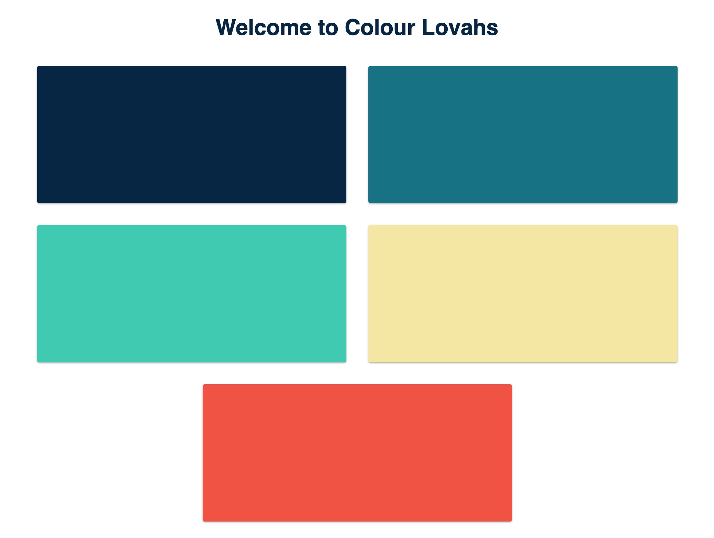

# colour-lovahs
**Refresh the page for a fresh colour palette!**

Built with the <a href="https://developer.mozilla.org/en-US/docs/Web/API/Fetch_API">Fetch API</a>, a <a href="http://colormind.io/api-access/">colour palette API</a>, and JS-injected markup.

I wanted to host the result on Netlify but the colour palette API only offers HTTP and that's no good.

So if you want to play with the site, please clone this repository and view the index file in a browser, or run `php -S localhost:8001` in your terminal.

